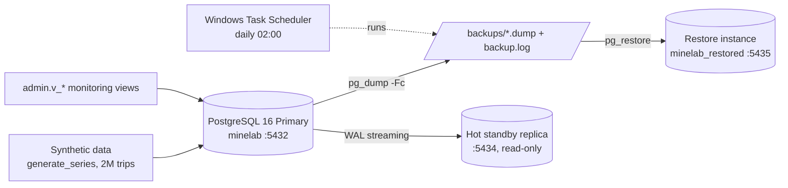

# PostgreSQL Production DBA Lab

A hands-on PostgreSQL administration lab built around a **synthetic** mining-fleet workload. It demonstrates access control, backup/restore, performance tuning, monitoring, lock/deadlock troubleshooting and scheduled backups.

> **This is a lab, not production experience.** All data is synthetic; credentials are throwaway lab values. My background is stronger in Data Engineering; I built this to go deeper on the operational side of databases.

## Architecture


## Quick start (Windows + Docker Desktop)
```powershell
Copy-Item .env.example .env
docker compose -f docker/docker-compose.yml up -d primary     # first start seeds 2M rows + roles (~1 min)
docker exec dbalab-primary psql -U postgres -d minelab -c "\dt fleet.*"
Get-Content sql/monitoring/01_health_views.sql | docker exec -i dbalab-primary psql -h localhost -U postgres -d minelab -f -
```
Reset everything: `docker compose -f docker/docker-compose.yml down -v`.

## What's covered
| Area | Evidence | Runbook / how to run |
|---|---|---|
| Access & security | access matrix below, `sql/roles/` | `docker exec -e PGPASSWORD=app_lab_pw dbalab-primary psql -h localhost -U app_user -d minelab -f /verify/verify_access.sql` |
| Backup | `backups/backup.log` | `scripts/backup/backup.ps1` |
| Restore + validation | row-count comparison, `VALIDATION PASSED` | `scripts/restore/restore.ps1`, `validate.ps1` |
| Recovery drill | 83,604 deleted rows recovered, audited | `scripts/restore/recovery_drill.ps1` -> [backup_restore.md](docs/runbooks/backup_restore.md) |
| Scheduled backup | daily task, 7-file retention | `scripts/backup/schedule_backup.ps1` (`-Remove` to undo) |
| Performance tuning | 3 queries, 15-85x faster | [performance_tuning.md](docs/runbooks/performance_tuning.md), `evidence/perf_*.txt` |
| Replication (primary -> hot standby) | streaming, ~22 ms replay lag, standby is read-only | [replication.md](docs/runbooks/replication.md), `scripts/replication/` |
| Monitoring, locks, deadlock, logging | blocking + deadlock traces | [monitoring_incidents.md](docs/runbooks/monitoring_incidents.md), `evidence/` |

## Access matrix (tested)
| User | read `fleet` | write `fleet` | `admin` schema | notes |
|---|---|---|---|---|
| app_user | yes | yes | no | ETL/application |
| analyst_user | approved tables only (haul_trip, truck, route) | no | no | |
| readonly_user | all fleet tables | no | no | |
| dba_user | yes | yes | yes | also `pg_monitor` |

`PUBLIC` has no access to the `public` schema and cannot connect to `minelab`.

## Lessons learned
- Logical backups restore to a point in time only; recovering changes after the backup needs WAL archiving / PITR.
- A function on an indexed column (`start_ts::date = ...`) defeats the index; rewrite the predicate.
- Indexes are not free: 3 indexes added ~161 MB to a 192 MB table and slow writes.
- Deadlocks come from inconsistent lock order; `pg_blocking_pids()` + `log_lock_waits` make blocking visible.
- Automation can hide failures: a typo in my retention path silently did nothing while the task reported success. I caught it by checking the path resolved, not the exit code.

## Known limitations
- Replication is async and failover/promotion is not tested or automated.
- No WAL archiving / PITR, no alerting, single machine.
- Performance gains are modest in milliseconds because the dataset fits in cache.
- Role passwords are hard-coded lab values in `sql/roles/01_roles.sql` (match `.env.example`).
